# Project Diagrams

Note: diagrams marked `conceptual` include extension flows described by the project architecture/spec but not currently implemented as concrete modules/functions in `src/`.

## 1) High-Level Architecture
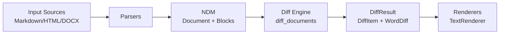

## 2) Folder/Module Dependency Boundaries
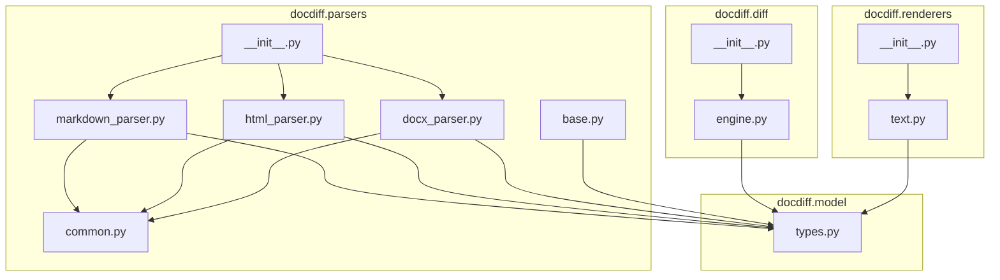

## 3) Parser Plugin Registry Flow (conceptual)
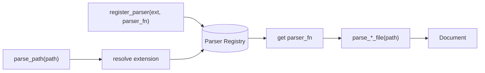

## 4) Renderer Plugin Registry Flow (conceptual)
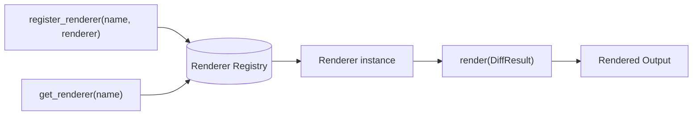

## 5) Normalized Document Model Class Diagram
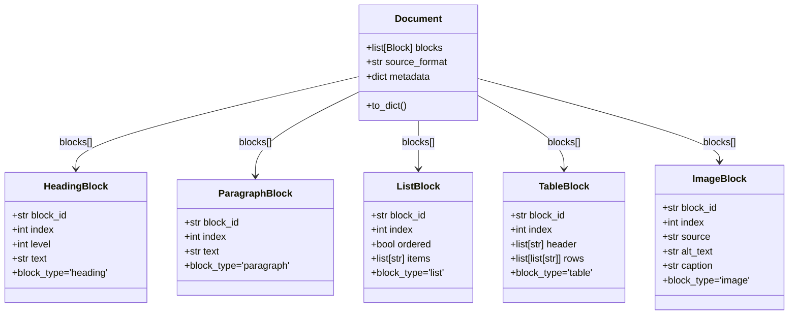

## 6) Parsing Pipeline Sequence (per format)
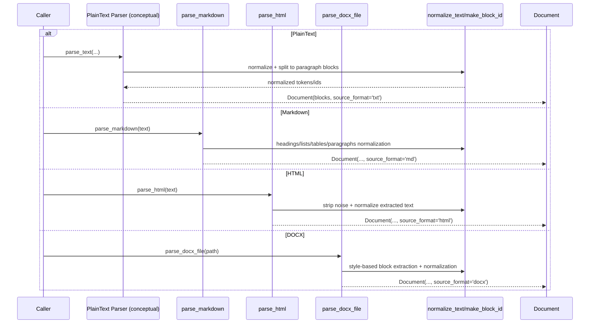

## 7) Diff Engine Sequence Diagram
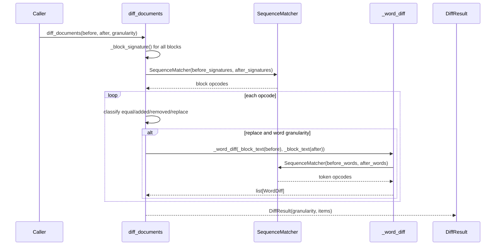

## 8) Block Matching Logic Flowchart
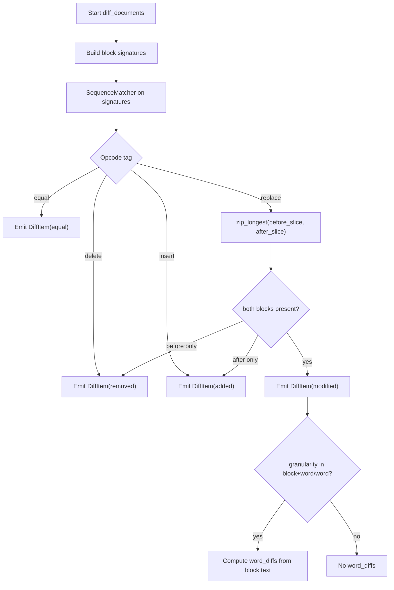

## 9) Word Diff Algorithm Diagram
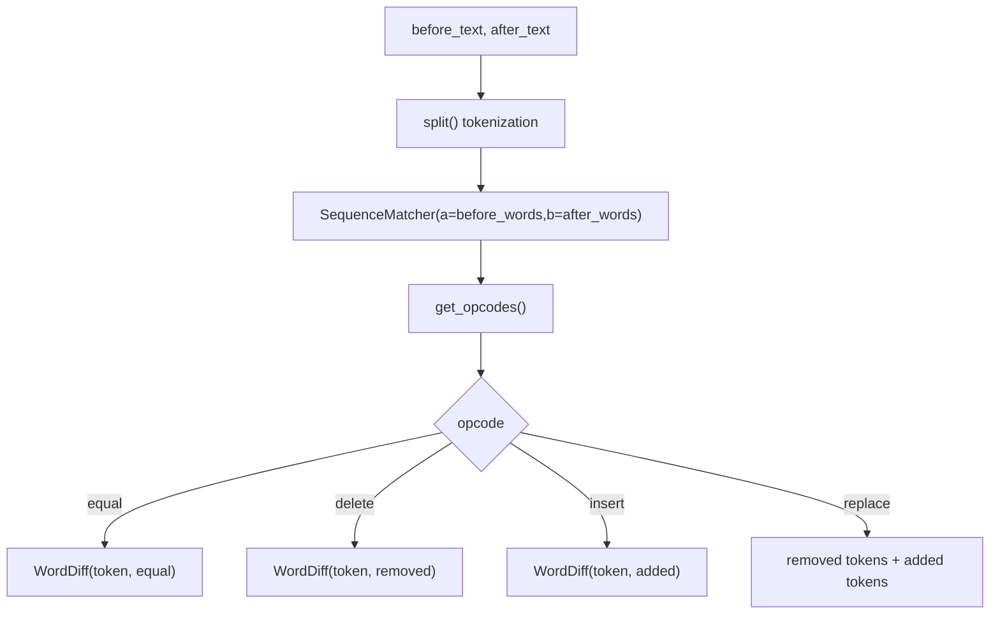

## 10) Table Diff Hierarchy
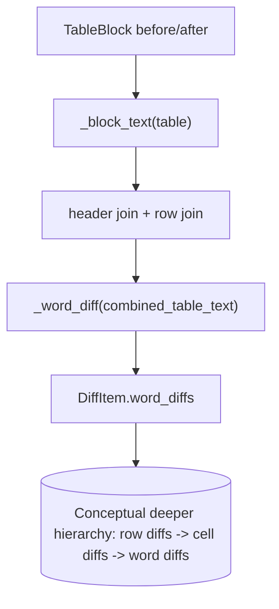

## 11) List Diff Hierarchy
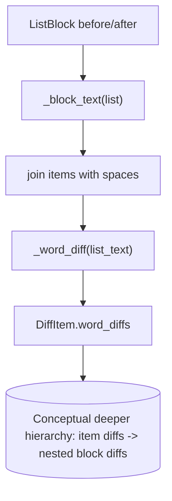

## 12) DiffResult Data Structure Diagram
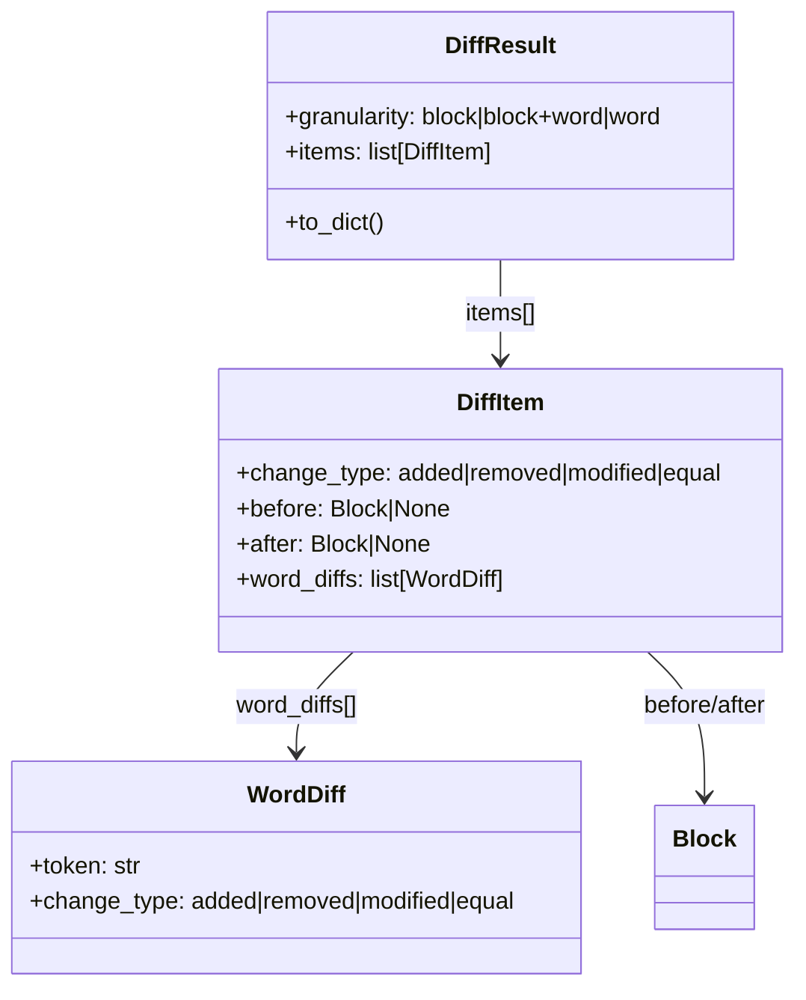

## 13) Text Renderer Formatting Flow
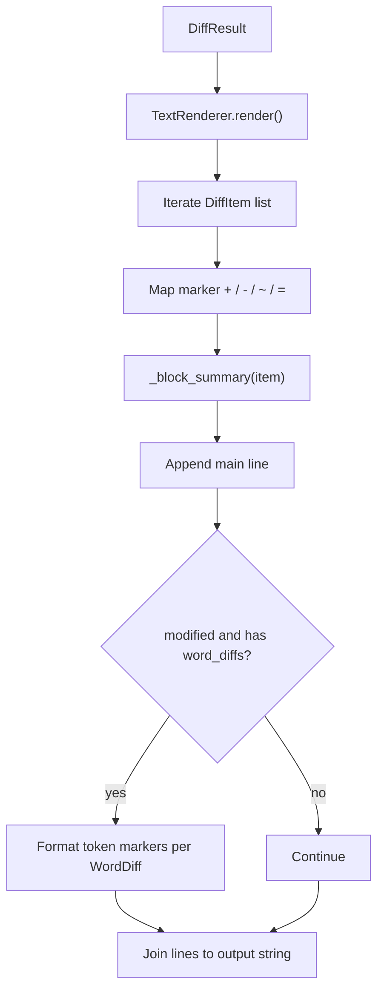

## 14) Cross-Format Diff Example Sequence
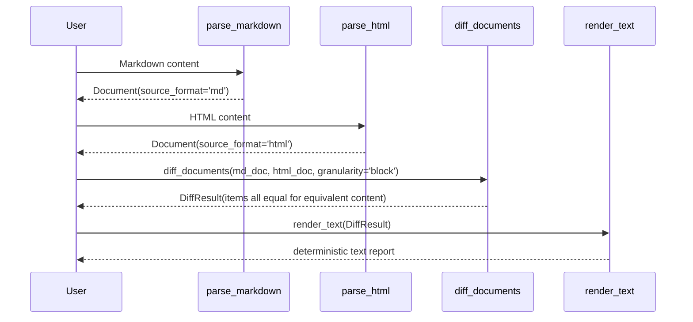

## 15) End-to-End CLI Flow (conceptual)
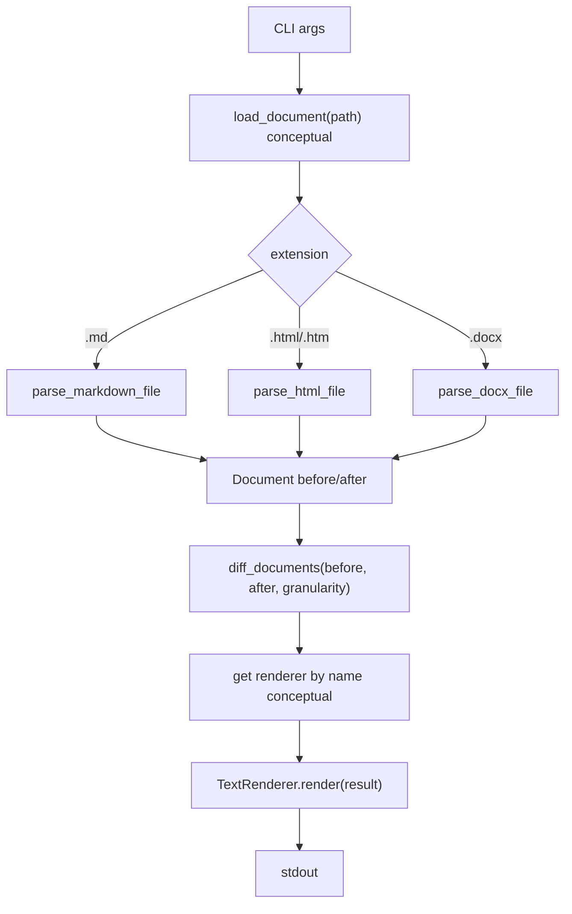
