# auditpy Project Diagrams

## 1) High-level System Architecture
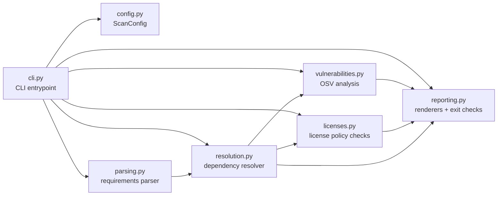

## 2) End-to-End Execution Flow (`auditpy scan`)
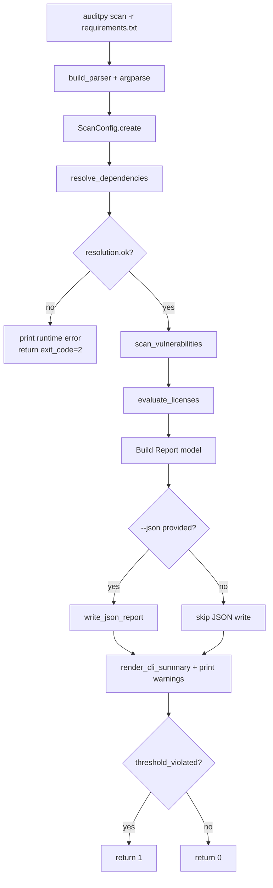

## 3) Dependency Resolution Workflow
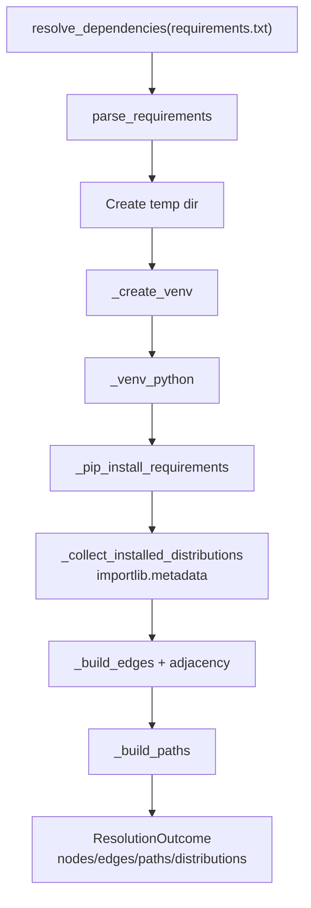

## 4) Dependency Graph Model
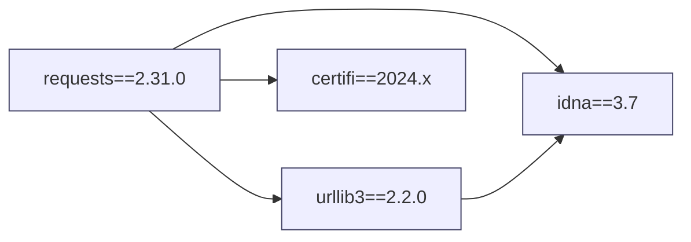

## 5) Vulnerability Analysis Pipeline
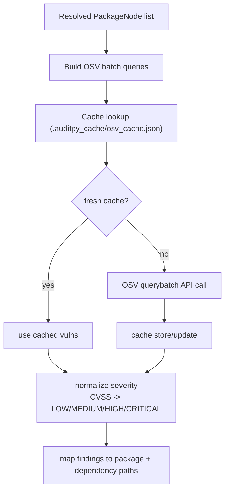

## 6) License Analysis Pipeline
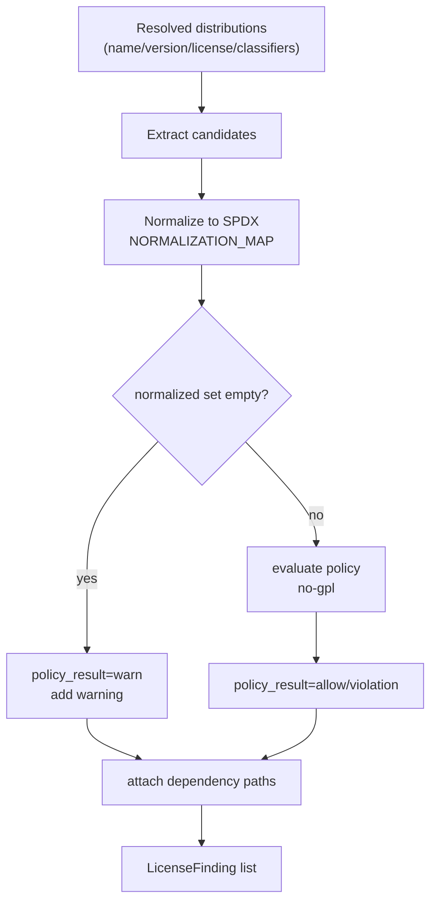

## 7) Dependency Path Tracing Algorithm
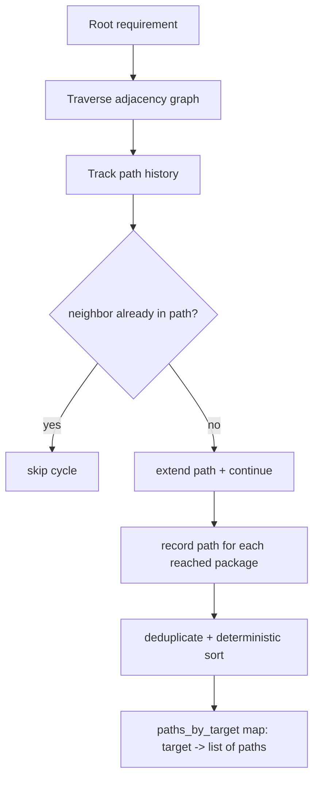

## 8) Report Generation Flow
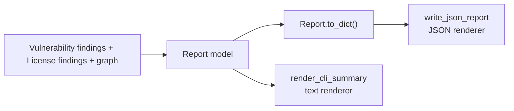

## 9) CLI Command Handling
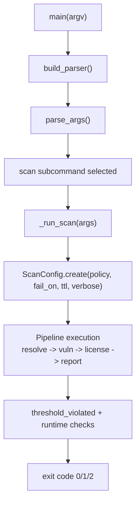

## 10) Exit Code Decision Flow
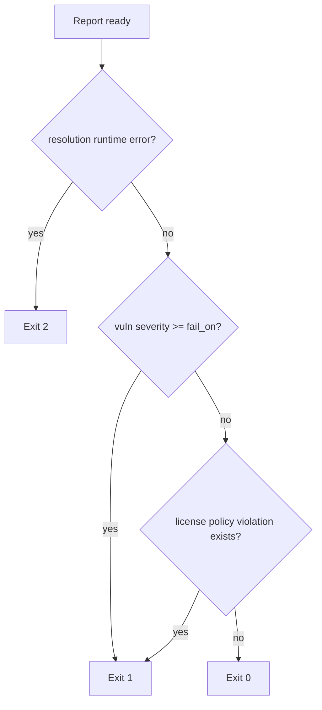

## 11) OSV Caching Mechanism
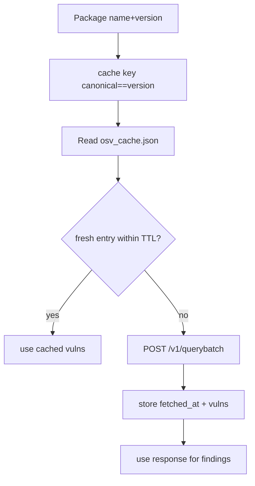

## 12) Error Handling and Failure Paths
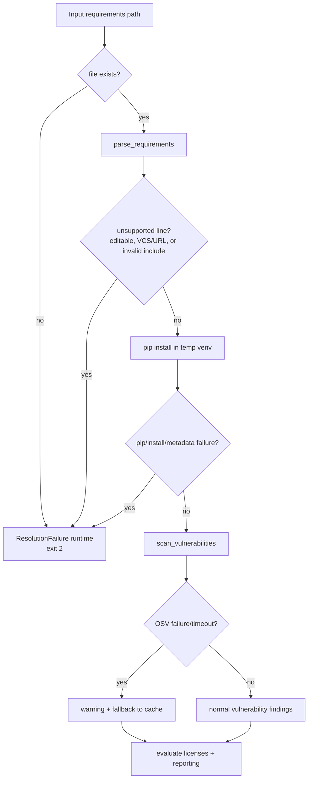

## 13) Project Module and Test Architecture
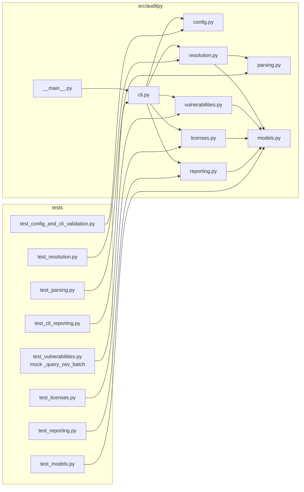
