# Diagrams

## 01_end_to_end_pipeline_flow

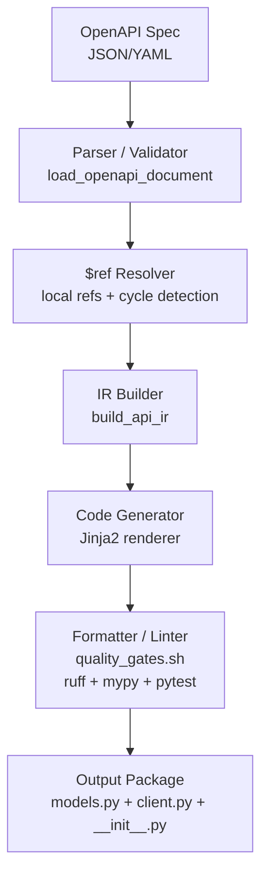

## 02_component_architecture

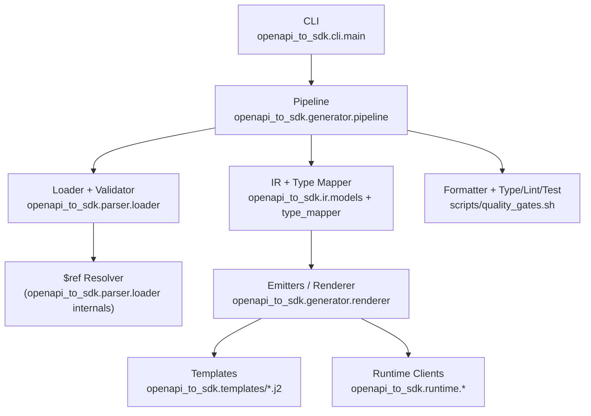

## 03_ir_data_model

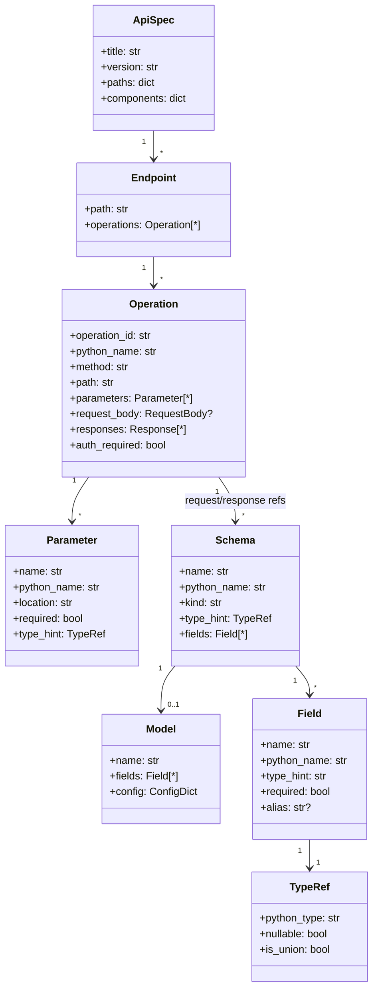

## 04_ref_resolution_flowchart

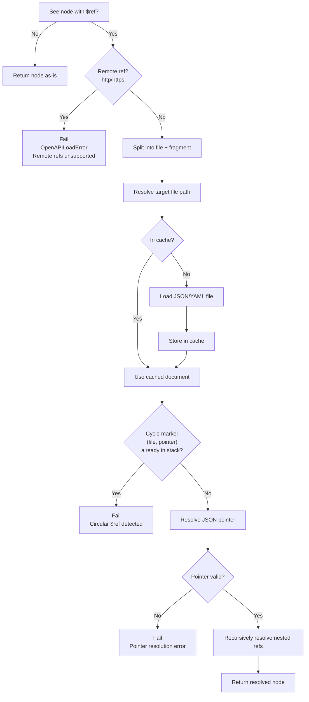

## 05_schema_to_python_type_mapping

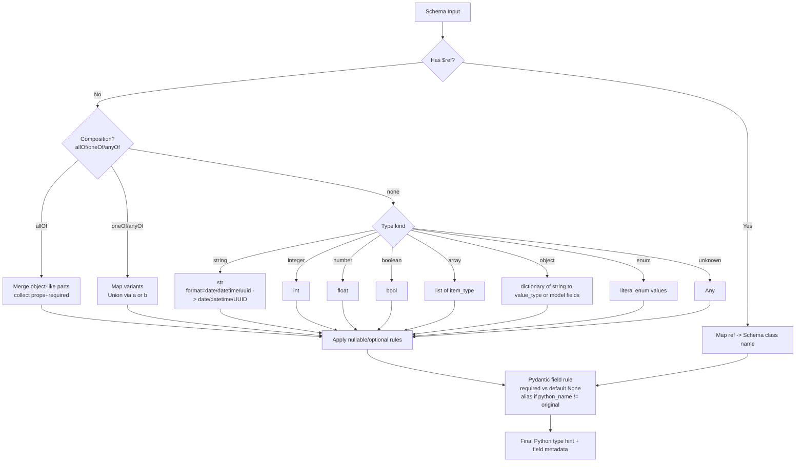

## 06_composition_handling

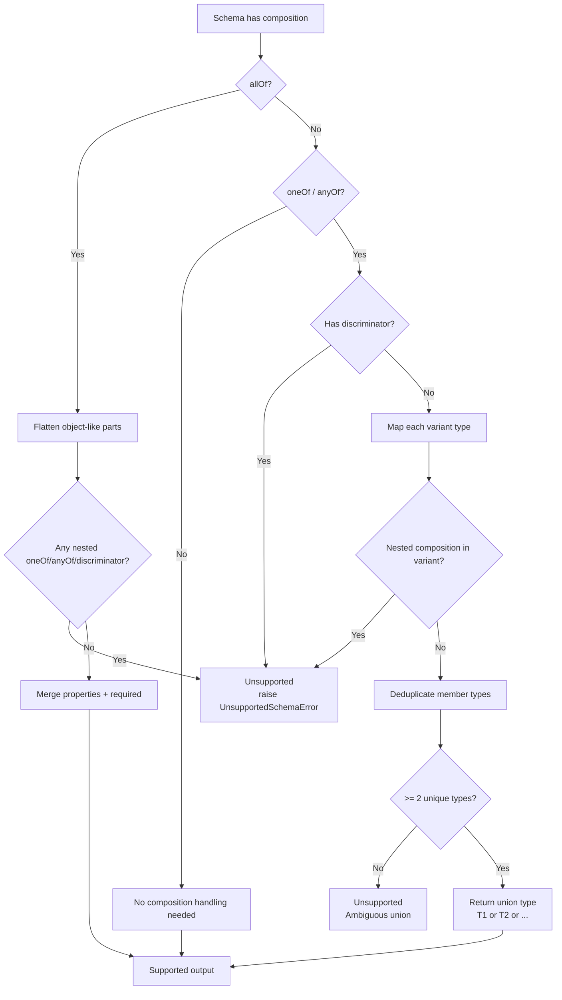

## 07_naming_normalization_flowchart

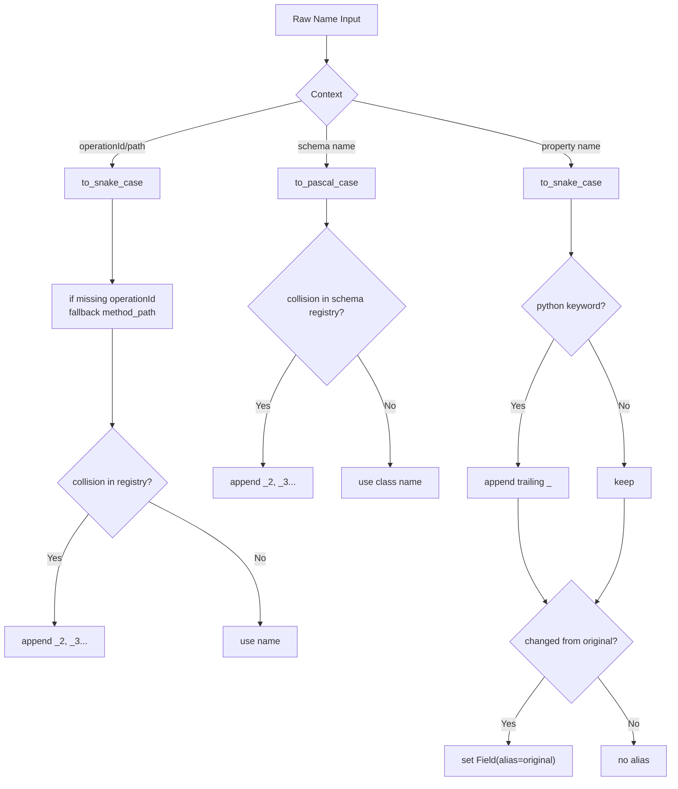

## 08_client_class_structure

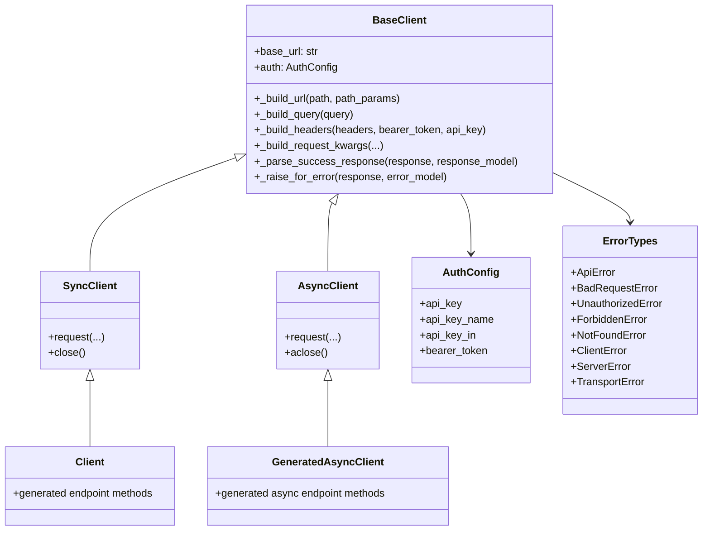

## 09_request_building_sequence

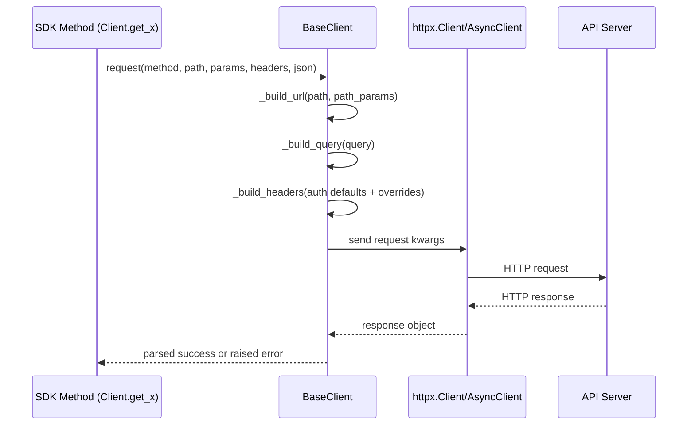

## 10_response_parsing_error_sequence

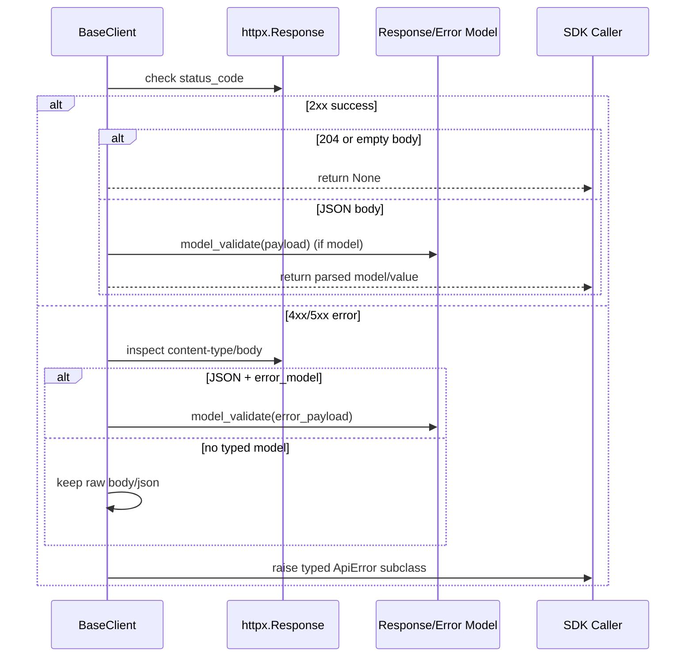

## 11_auth_injection_flowchart

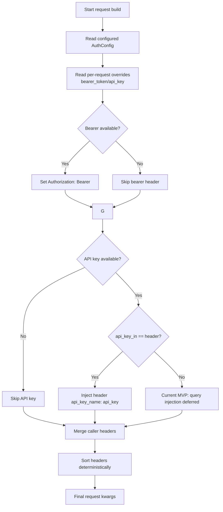

## 12_pagination_helper_behavior

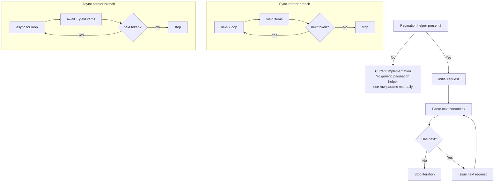

## 13_generated_tests_architecture

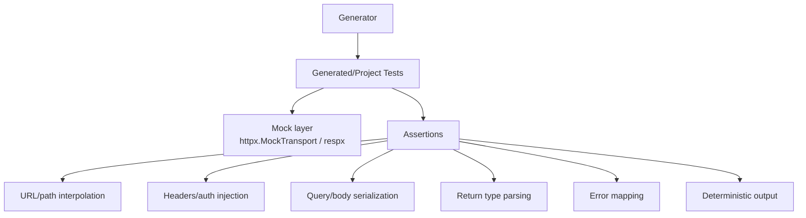

## 14_golden_file_regression_testing

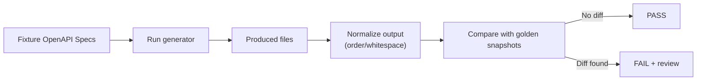

## 15_release_ci_pipeline

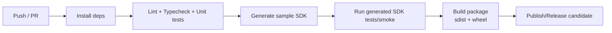

