# Project Diagrams

## 1) System Architecture Overview
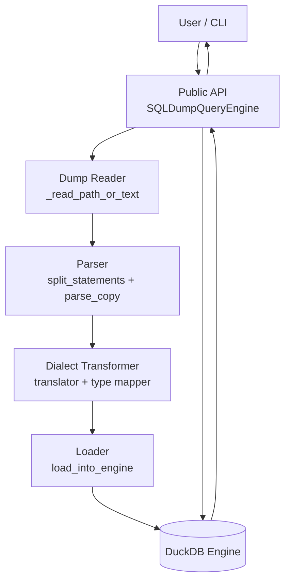

## 2) Data Flow Diagram
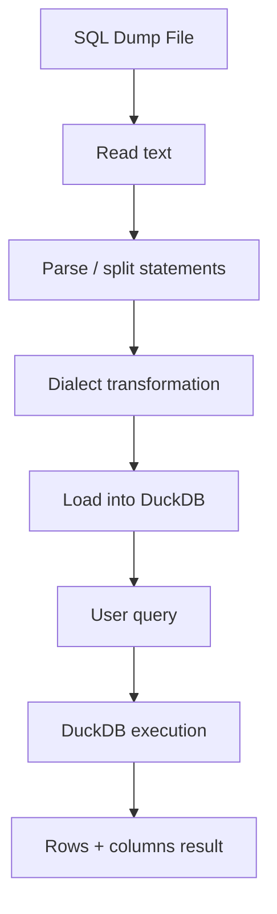

## 3) Dump Processing Pipeline
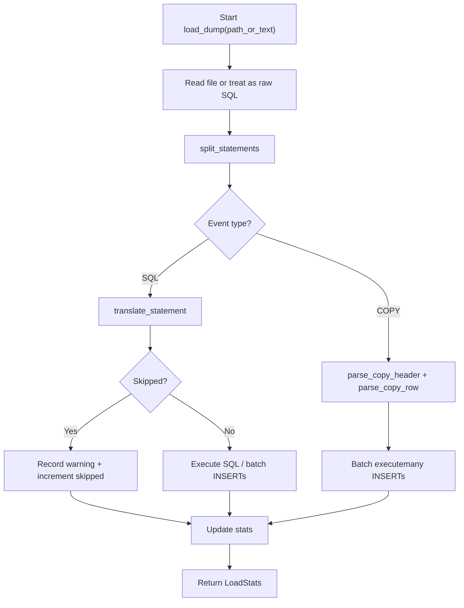

## 4) Class Diagram
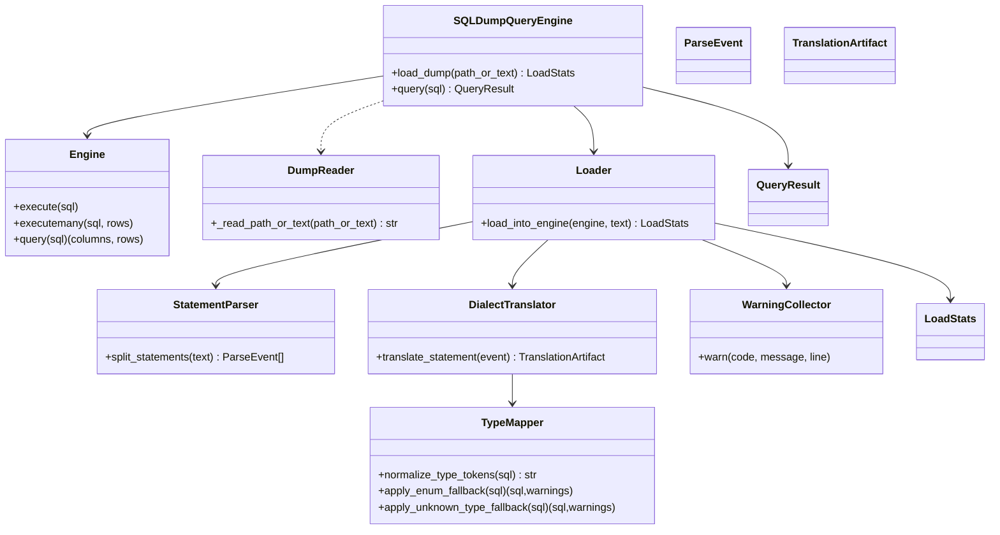

## 5) Sequence Diagram: Loading a Dump
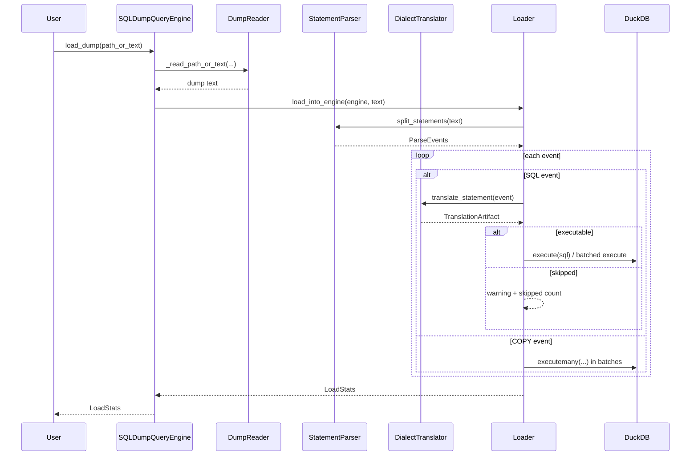

## 6) Sequence Diagram: Executing a Query
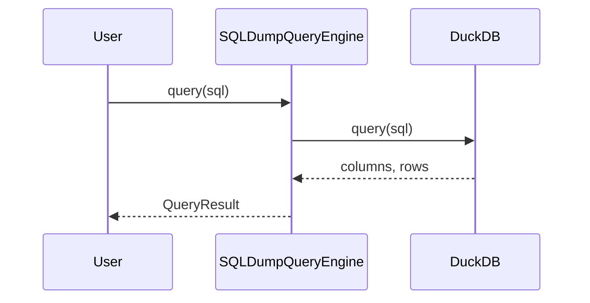

## 7) SQL Statement Parsing State Machine
```mermaid
stateDiagram-v2
    [*] --> Idle
    Idle --> InSQL: non-whitespace
    InSQL --> InSingleQuote: '
    InSQL --> InDoubleQuote: "
    InSQL --> InBacktick: `
    InSQL --> InLineComment: -- or #
    InSQL --> InBlockComment: /*
    InSQL --> StatementComplete: ; outside quotes/comments

    InSingleQuote --> InSQL: closing '
    InDoubleQuote --> InSQL: closing "
    InBacktick --> InSQL: closing `
    InLineComment --> InSQL: newline
    InBlockComment --> InSQL: */

    Idle --> CopyHeader: line matches COPY ... FROM stdin;
    CopyHeader --> CopyRows
    CopyRows --> CopyRows: read row
    CopyRows --> StatementComplete: line == \\.

    StatementComplete --> Idle: emit ParseEvent
```

## 8) Dialect Translation Workflow
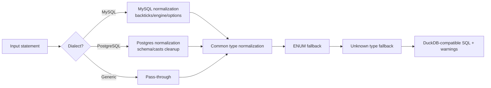

## 9) Type Mapping Flow
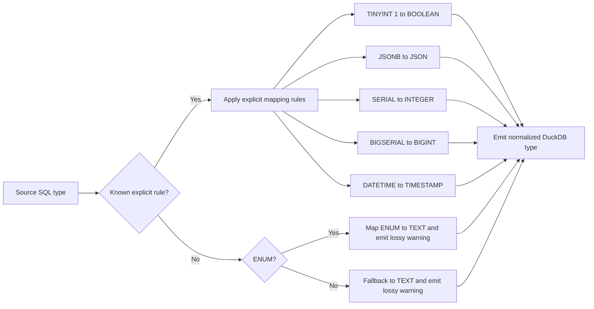

## 10) Error Handling Flowchart
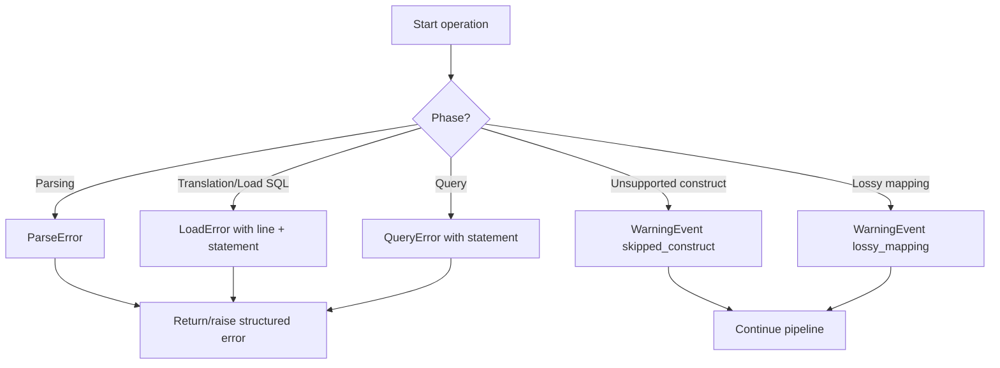

## 11) Streaming File Processing Diagram
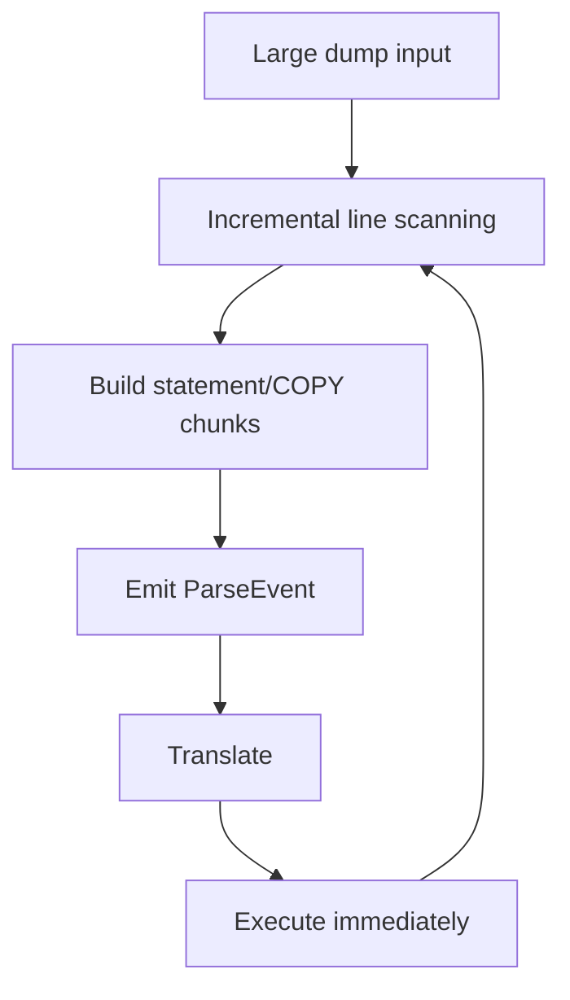

## 12) COPY Block Handling Flow
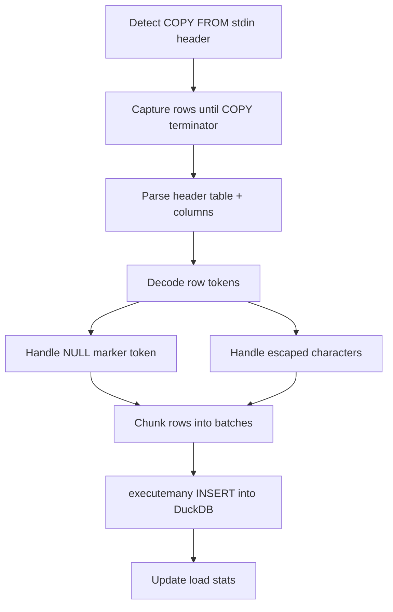

## 13) Insert Loading Strategy Diagram
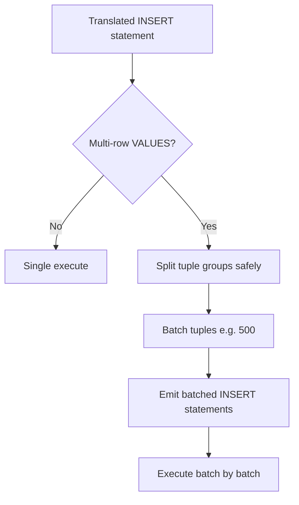

## 14) Component Interaction for Dialect Modules
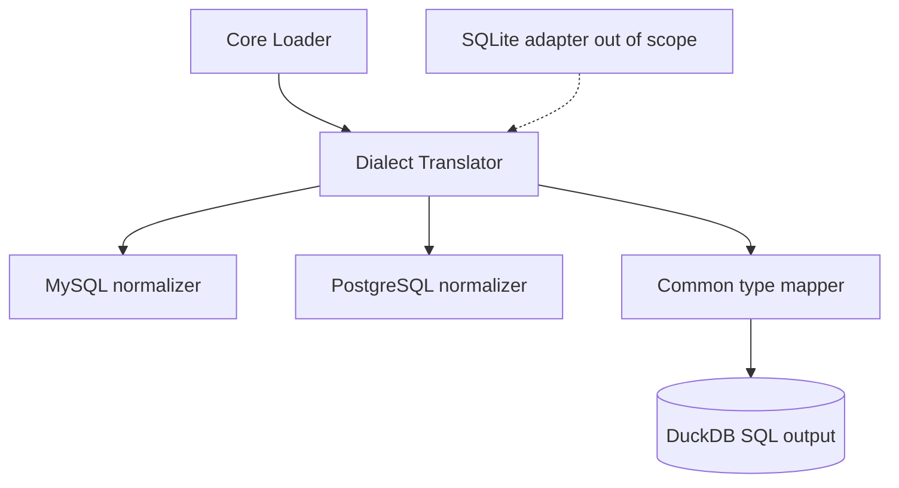

## 15) Test Architecture Diagram
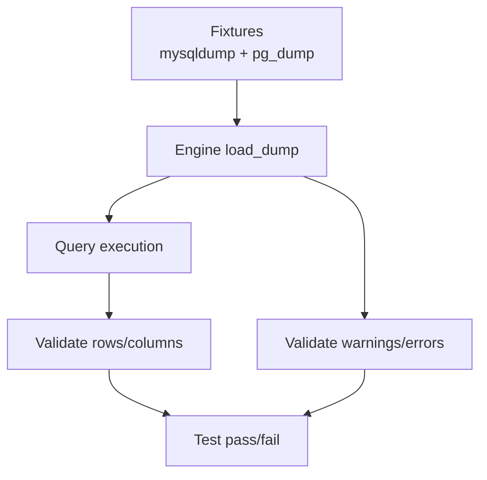

## 16) Performance Optimization Flow
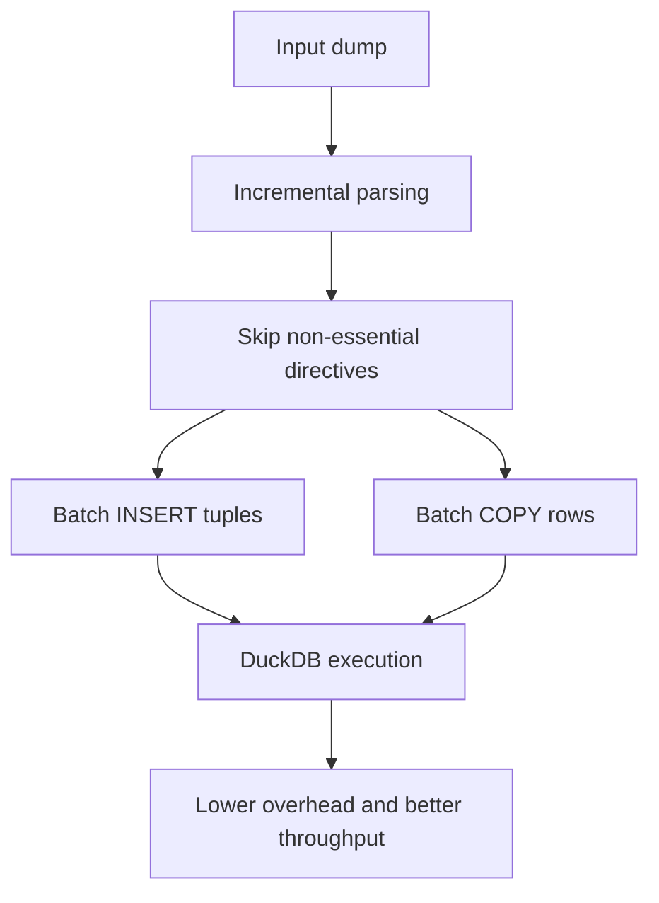

## 17) API Usage Diagram
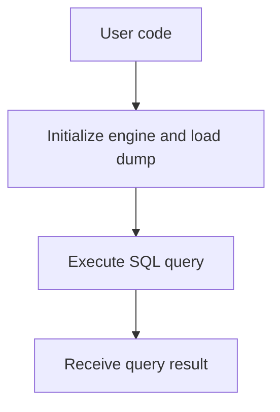
